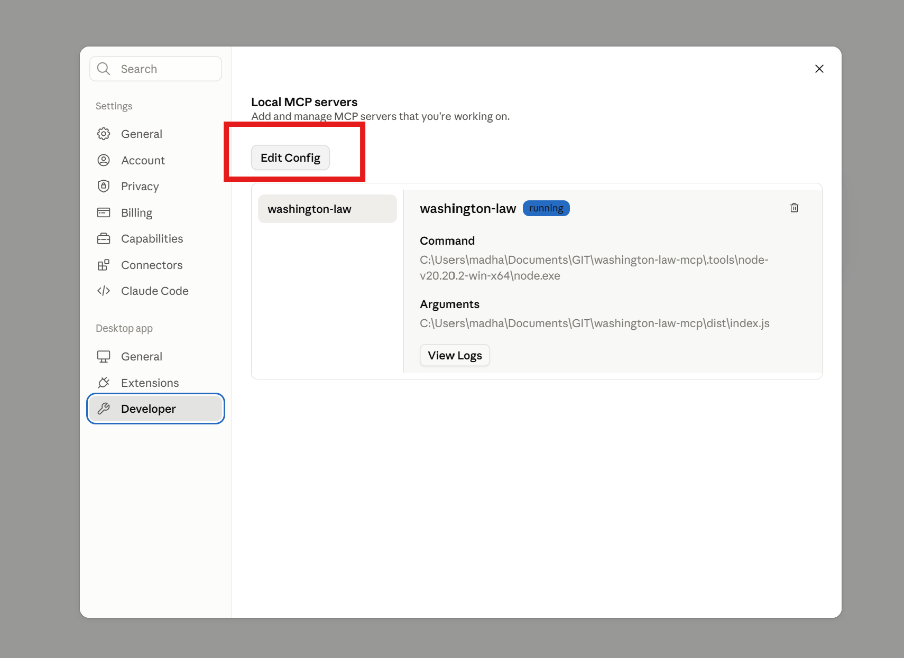

# Washington Law MCP Server

An MCP (Model Context Protocol) server that provides offline access to Washington State's Revised Code of Washington (RCW) and Washington Administrative Code (WAC) for AI agents.

## Requirements
- ** Node.js v20

## Features

- **Completely Offline**: All law texts are stored locally in SQLite database
- **Fast Access**: Instant retrieval of any RCW or WAC section
- **Full-Text Search**: Search across all Washington laws using SQLite FTS5
- **Comprehensive Coverage**: Access to all RCW titles, chapters, and sections
- **MCP Compatible**: Works with any MCP-compatible AI client (Claude, etc.)

## Architecture

The project consists of two main components:

1. **Data Collection Phase** (one-time setup): Scrapers that download all RCW/WAC texts
2. **MCP Server** (runtime): Serves law texts from local database with no external calls

## Installation

```bash
# Clone the repository
git clone <repository-url>

# Install dependencies
npm install

# Initialize the database
npm run init:db

# Scrape RCW data (this will take several hours)
npm run scrape:rcw

# Build the TypeScript code
npm run build
```

## Usage

### Switch to use Node v20
```
Run `.\.tools\use-node20.ps1`
```

### Running the MCP Server

```bash
npm start
```

### Testing with MCP Inspector

```bash
npm test
```

### Configuring with Claude Desktop

#### MacOS
Add to your Claude Desktop configuration (`~/Library/Application Support/Claude/claude_desktop_config.json`):

```json
{
  "mcpServers": {
    "washington-law": {
      "command": "node",
      "args": ["/path/to/law_rule_mcp/dist/index.js"]
    }
  }
}
```

#### Windows
Add to your Claude Desktop configuration (`"~\AppData\Local\Packages\Claude_pzs8sxrjxfjjc\LocalCache\Roaming\Claude\claude_desktop_config.json"`)

If you can't locate the file in above location, you can also find it via following screen in your Claude Desktop > hamburger menu (=) > Settings > Developer
File will have a lot of other settings, don't disturb them but just add another json field e.g. after `preferences` as shown below.

Then, completely restart the Claude Desktop. i.e. Close it even from Task Manager and start again, not just closing the app.
You should see MCP server running in developer settings as in the screenshot below.




```json
  "preferences": {....},
  "mcpServers": {
    "washington-law": {
      "command": "C:\\your\\path\\to\\washington-law-mcp\\.tools\\node-v20.20.2-win-x64\\node.exe",
      "args": [
        "C:\\your\\path\\to\\washington-law-mcp\\dist\\index.js"
      ]
    }
  }
```


## Available MCP Tools

### `get_rcw`
Retrieve the full text of a specific RCW section.
- **Parameters**: 
  - `citation` (string): RCW citation (e.g., "46.61.502")

### `get_wac`
Retrieve the full text of a specific WAC section.
- **Parameters**:
  - `citation` (string): WAC citation (e.g., "296-24-12005")

### `search_laws`
Search Washington laws by keywords or phrases.
- **Parameters**:
  - `query` (string): Search terms
  - `limit` (number, optional): Max results (default: 20)

### `list_rcw_titles`
List all RCW titles with section counts.

### `list_rcw_chapters`
List all chapters within a specific RCW title.
- **Parameters**:
  - `titleNum` (string): Title number (e.g., "46")

### `list_rcw_sections`
List all sections within a specific RCW chapter.
- **Parameters**:
  - `chapterNum` (string): Chapter number (e.g., "46.61")

### `get_statistics`
Get database statistics including section counts and last update time.

## Project Structure

```
law_rule_mcp/
├── src/
│   ├── index.ts              # MCP server entry point
│   ├── database/
│   │   ├── init.ts          # Database initialization
│   │   └── database.ts      # Database access layer
│   ├── scraper/
│   │   └── rcw-scraper.ts   # RCW web scraper
│   └── types.ts             # TypeScript type definitions
├── data/
│   └── washington-laws.db   # SQLite database (created after scraping)
├── package.json
├── tsconfig.json
└── README.md
```

## Database Schema

The SQLite database contains:

- **rcw** table: Full text and metadata for all RCW sections
- **wac** table: Full text and metadata for all WAC sections  
- **rcw_fts** / **wac_fts**: Full-text search indexes
- **metadata** table: Database version and update timestamps
- **scraper_progress** table: Tracks scraping progress

## Updating the Database

To update the law database with the latest changes:

```bash
# Re-run the scraper to fetch updated laws
npm run scrape:rcw
```

The scraper will update existing sections and add new ones.

## Development

```bash
# Watch mode for development
npm run dev

# Build TypeScript
npm run build

# Test with MCP inspector
npm test
```

## Notes

- Initial scraping takes several hours due to rate limiting (respectful crawling)
- Database size is approximately 200-500 MB after compression
- The server operates completely offline once data is scraped
- All database queries are read-only during MCP server operation

## License

MIT